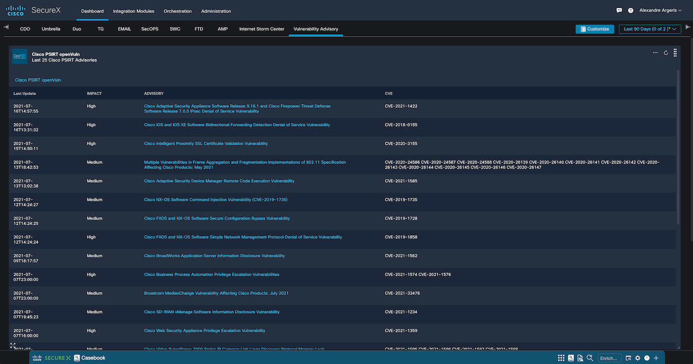
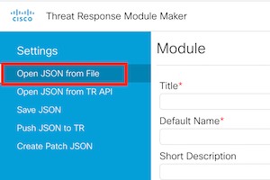
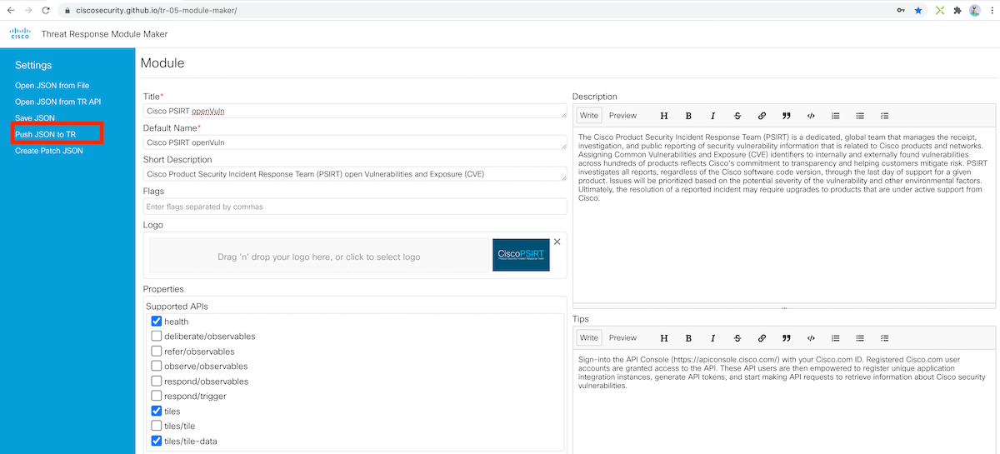
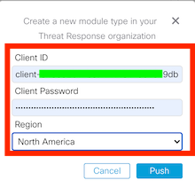
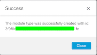
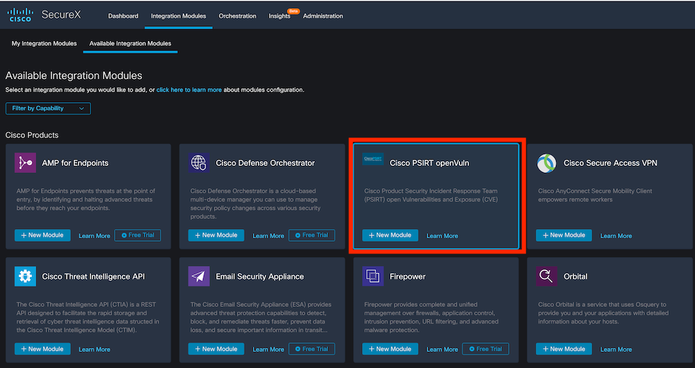
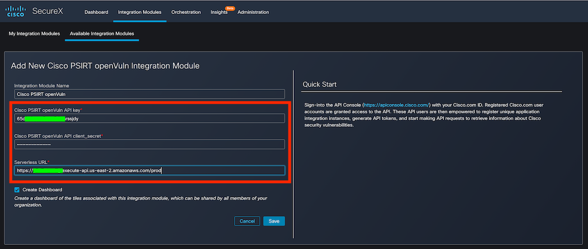
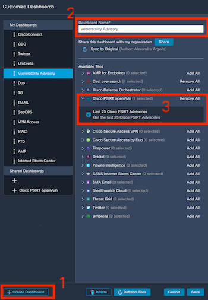
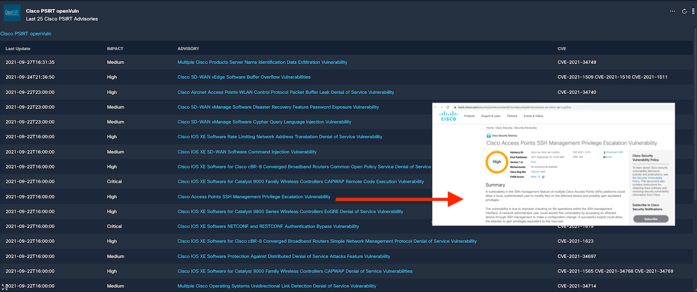

# SecureX Cisco PSIRT openVuln relay module

Create Cisco Product Security Incident Response Team (PSIRT) open Vulnerabilities and Exposure (CVE) module in Cisco SecureX.



The Cisco Product Security Incident Response Team (PSIRT) is a dedicated, global team that manages the receipt, investigation, and public reporting of security vulnerability information that is related to Cisco products and networks. Assigning Common Vulnerabilities and Exposure (CVE) identifiers to internally and externally found vulnerabilities across hundreds of products reflects Cisco’s commitment to transparency and helping customers mitigate risk. PSIRT investigates all reports, regardless of the Cisco software code version, through the last day of support for a given product. Issues will be prioritized based on the potential severity of the vulnerability and other environmental factors. Ultimately, the resolution of a reported incident may require upgrades to products that are under active support from Cisco.

The Relay itself is just a simple application written in Python that can be
easily packaged and deployed as an AWS Lambda Function using
[Zappa](https://github.com/Miserlou/Zappa).

Use cases :
  - Track Cisco Product Advisories

For any questions or comments/bugs please reach out to me at aargeris@cisco.com

## Rationale

1. We need an application that will translate API requests from SecureX Threat Response
to Cisco PSIRT API. This application is provided here in the GitHub repository, and we are going to install it in AWS Lambda
using Zappa.

2. AWS Lambda allows us to deploy our application without deploying a dedicated
server or paying for so called "idle" cycles. AWS handles instantiation and
resource provisioning; all we need to do is define the access rights and upload
our application.

3. Zappa is a helper tool that will package our application and publish it to
AWS as a Lambda function. It abstracts a large amount of manual configuration
and requires only a very simple configuration file, which we have provided and
will explain how to customize it during this process.

## Step 1: Requirements Installation

First of all, make sure that you already have Python 3 installed by typing
```
python3 --version
```
in your command-line shell.

The application has been implemented and tested using `Python 3.7`. You may try
to use any higher versions if you wish as they should be backward-compatible.

After that, you have to create a "virtual environment" to isolate the
application-specific requirements from the libraries globally installed to your
system. Here are the steps to follow:

1. Create a virtual environment named `venv`:

   `python3 -m venv venv`

2. Activate the virtual environment:
   - Linux/Mac: `source venv/bin/activate`
   - Windows: `venv\Scripts\activate.bat`

3. Upgrade PIP (optional):

   `pip install --upgrade pip`

**NOTE**. The virtual environment has to be created only once, you just have
to make sure to activate it each time you are working on or playing with the
application (modern IDEs can automatically do that for you). You can deactivate
a previously activated virtual environment by simply typing `deactivate` in
your command-line shell.

Finally, install the libraries required for the application to function from
the [requirements.txt](code/requirements.txt) file:

```
pip install --upgrade --requirement requirements.txt
```

## Step 2: Application Deployment

### AWS Lambda Function

First set up your deployment settings for you with the following command:
```
zappa init
```

To `deploy` your application to AWS as a Lambda function for the first time,
run the following command:
```
zappa deploy dev
```

**NOTE**. Here `dev` is just the name of the default stage. You may define as
many stages as you like. Each Zappa command requires a stage to be specified so
make sure to replace `dev` with the name of your custom stage when necessary.

Once the Lambda has been deployed, make sure to save the public `URL` to your
Lambda returned by Zappa. It will look like this:
```
https://<RANDOM_ID>.execute-api.<AWS_REGION>.amazonaws.com/<STAGE>
```

You can check the `status` of your deployment with the corresponding command:
```
zappa status dev
```

Notice that you have to `deploy` your Lambda only once. Each time you make
changes to the source code or to the settings file you just have to `update`
the Lambda by running the following command:
```
zappa update dev
```

As a bonus, you can also monitor your Lambda's HTTP traffic in near real-time
with the `tail` command:
```
zappa tail dev --http
```

If you do not need your Lambda anymore you can run the following command to
get rid of it altogether and clean up the underlying resources:
```
zappa undeploy dev
```

**NOTE**. The `deploy` command always returns a brand new `URL`. The `update`
command does not change the current `URL`. The `undeploy` command destroys the
old `URL` forever.

## Step 3: Getting access to Cisco PSIRT API

There are four prerequisites needed before a user can initiate the API service calls and obtain access to the underlying Cisco security vulnerability information.

[Sign-in to the API Console](https://apiconsole.cisco.com/) with your Cisco.com ID . Registered Cisco.com user accounts are granted access to the API. These API users are then empowered to register unique application integration instances, generate API tokens, and start making API requests to retrieve information about Cisco security vulnerabilities.
The Cisco PSIRT openVuln API applications require an API "access token" in order to authenticate each individual API request. To generate such an access token (typically performed upon startup, or just prior to accessing the API), the application performs an OAuth2 client credentials grant flow. Registering an application with the Cisco API Developer Portal generates all the details needed to successfully complete the authentication sequence. The registration process creates the client credentials along with name assignment, description, and subscribes the client application to one or more of the OAuth v2.0 grant types requested for their client application.

## Step 4: Installing the relay module

Browser to [The SecureX module maker](https://ciscosecurity.github.io/tr-05-module-maker/) and open the JSON [Cisco_PSIRT_openVuln_module_type.json](code/Cisco_PSIRT_openVuln_module_type.json) from this githubby clicking on `Open JSON from File`.



Feel free to change the module title or the description if you want and then click on `Push JSON to TR`.



Enter your [Cisco SecureX API credential](https://securex.us.security.cisco.com/help/securex/topic/integration) and Region and click on `Push`



Make sure the module was deployed successfully. If not double check your API credential.



Now after a page refresh in your Cisco SecureX `Available Integration Modules` you should see the new module `Cisco PSIRT openVuln` available. Click on `+ New Module`



Add your Cisco PSIRT API key and client_secret from Step 3 and URL from Step 2 and click `Save`.



## Step 5: Adding tile to dashboard

You can create a new doashboard `+ Create Dashboard` or add the new tile to a existing one and click on `Save`.



If working, you should see the last 25 Cisco PSIRT Advisories with link to additional information.



For any questions or comments/bugs please reach out to me at aargeris@cisco.com